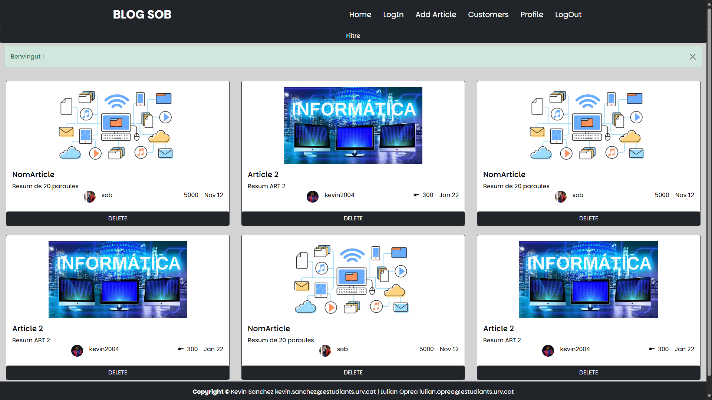
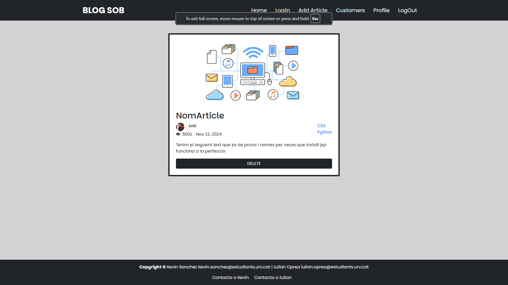
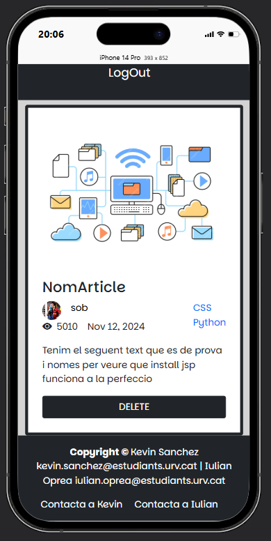
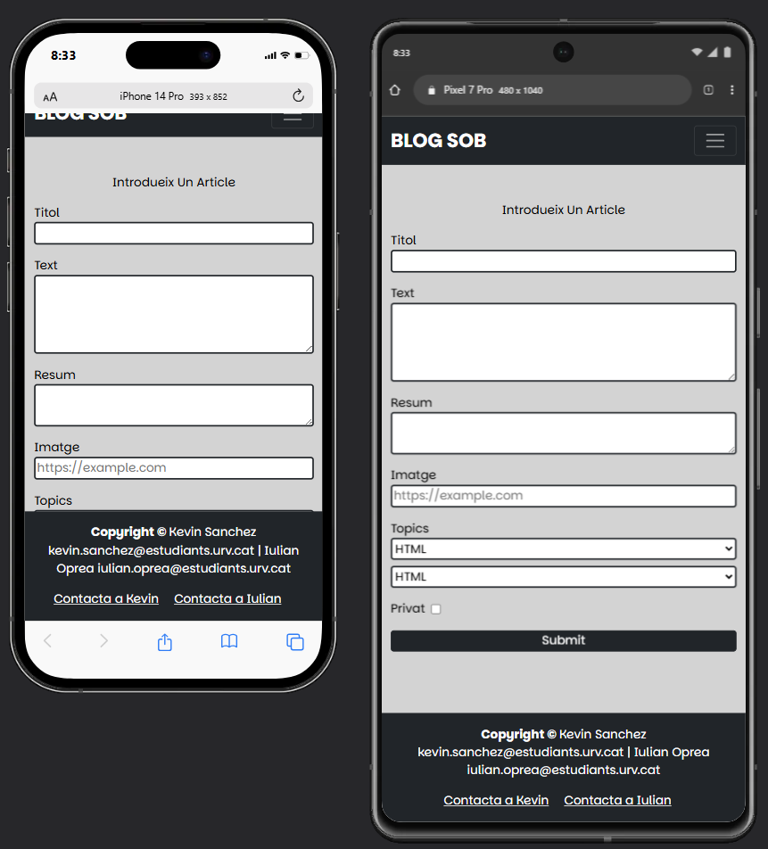
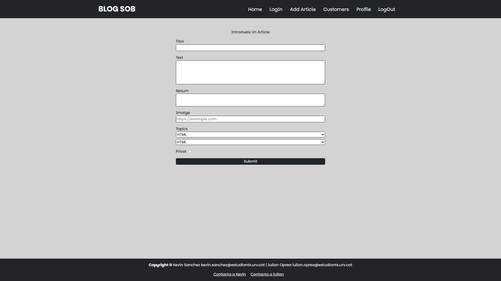
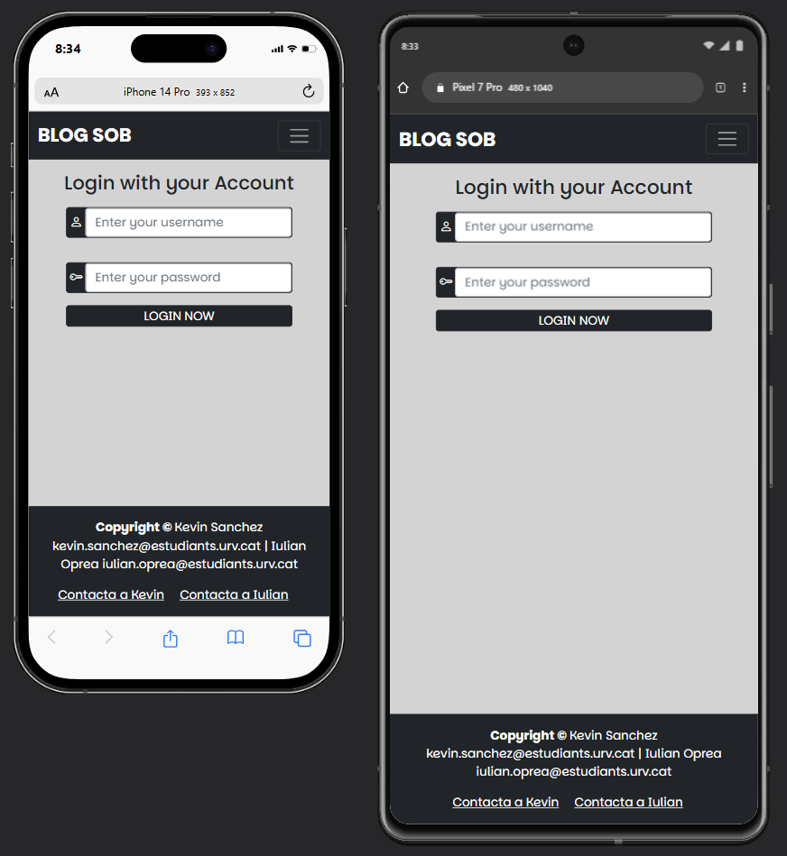
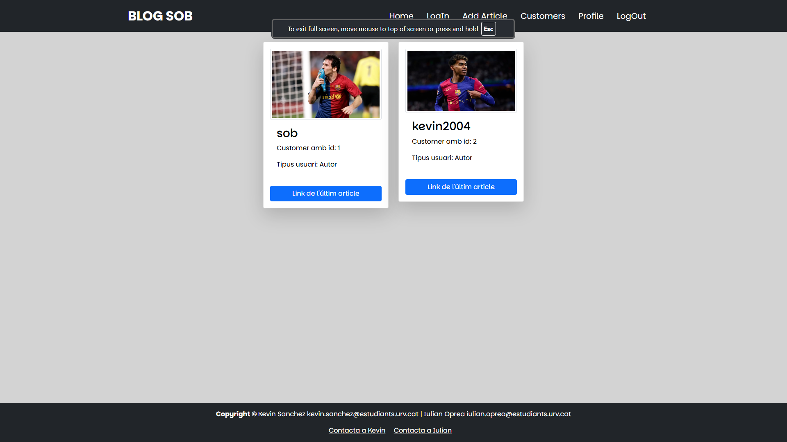

<h1>Web for publishing articles about programming</h1>

<h2>What is this project ?</h2>
    
This is a Web Page about programming articles

    
<h2>What you can find in this Readme? </h2>
    
In this README, you have photos of the different sections that this web application has. If you want to test it, you have to use GlassFish Server, Apache NetBeans, and JavaDB (this is what has been used to develop it). The installation manual is in the                   documentacion2.pdf in the last pages called Manual de instal·lació, but it is in Catalan. There are images, and it should be understandable even without knowing the Catalan language.

<h2>Photos of the different sections</h2>
<ul>
    <li>
        <h3>Articles</h3>
        
        
    </li>
    <li>
        <h3>Article</h3>
        
        
    </li>
    <li>
        <h3>LogIn</h3>
        
        
    </li>
    <li>
        <h3>AddArticle</h3>
        
        
    </li>
    <li>
        <h3>Customers</h3>
        
        
    </li>
    <li>
        <h3>Profile</h3>
        
        
    </li>
</ul>
